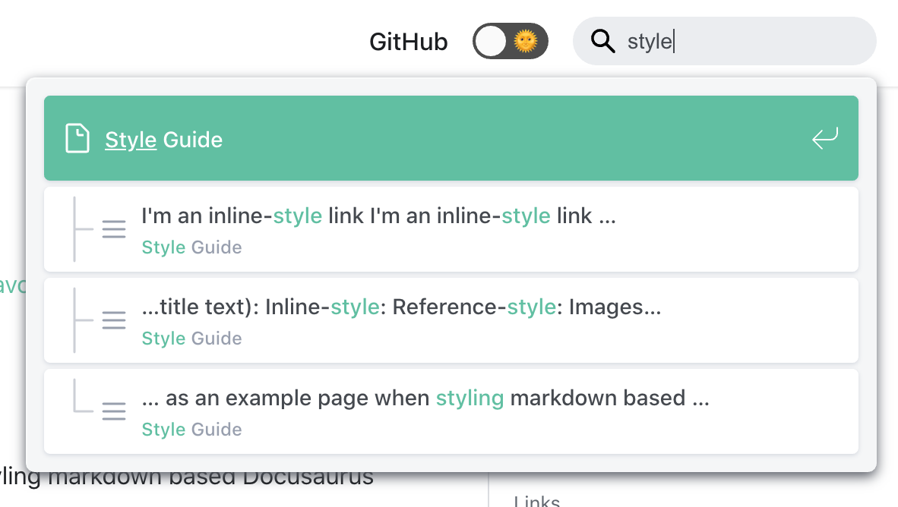
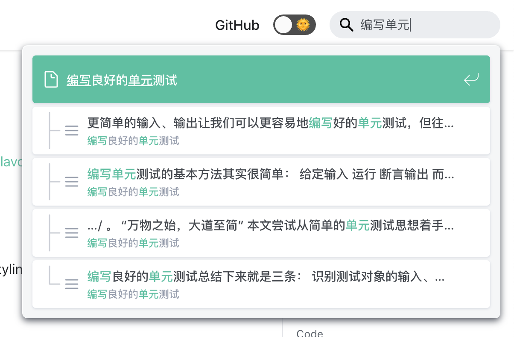

# @easyops-cn/docusaurus-search-local

[](https://www.npmjs.com/package/@easyops-cn/docusaurus-search-local)
[](https://github.com/easyops-cn/docusaurus-search-local/actions?query=workflow%3ACI)
[](https://coveralls.io/github/easyops-cn/docusaurus-search-local?branch=master)

An offline/local search plugin for [Docusaurus v2](https://v2.docusaurus.io/), which supports multiple languages, especially optimized for language of zh.

> Originally forked from [cmfcmf/docusaurus-search-local](https://github.com/cmfcmf/docusaurus-search-local).
>
> Then later fully rewritten with TypeScript 💪, styles polished 💅, language of Chinese supported 🇨🇳, and tests covered ✅.

- [Live Demo](#live-demo)
- [Screen Shots](#screen-shots)
- [Installation](#installation)
- [Usage](#usage)
- [Plugin Options](#plugin-options)
- [Custom Styles](#custom-styles)
- [Trouble Shooting](#trouble-shooting)
- [Further Reading](#further-reading)
- [Contributing](#contributing)

## Live Demo

https://easyops-cn.github.io/docusaurus-search-example/

## Screen Shots





## Installation

```shell
npm install --save @easyops-cn/docusaurus-search-local
# or
yarn add @easyops-cn/docusaurus-search-local
```

## Usage

Add `@easyops-cn/docusaurus-search-local` into your docusaurus plugins.

````js
// In your `docusaurus.config.js`:
module.exports = {
  // ... Your other configurations.
  plugins: [
    // ... Your other plugins.
    [
      require.resolve("@easyops-cn/docusaurus-search-local"),
      {
        // ... Your options.
        // `hashed` is recommended as long-term-cache of index file is possible.
        hashed: true,
        // For Docs using Chinese, The `language` is recommended to set to:
        // ```
        // language: ["en", "zh"],
        // ```
        // When applying `zh` in language, please install `nodejieba` in your project.
      },
    ],
  ],
};
````

> Notice!
>
> When applying `"zh"` in language, please also install `nodejieba` in your project, which is required for tokenizing Chinese words. It is removed from peerDependencies since v0.20.0, so you have to install it manually even if you're using npm v7+.

```shell
npm install nodejieba
# or
yarn add nodejieba
```

## Plugin Options

| Name                             | Type                                     | Default      | Description                                                                                                                                  |
| -------------------------------- | ---------------------------------------- | ------------ | -------------------------------------------------------------------------------------------------------------------------------------------- |
| indexDocs                        | boolean                                  | `true`       | Whether to index docs.                                                                                                                       |
| indexBlog                        | boolean                                  | `true`       | Whether to index blog.                                                                                                                       |
| indexPages                       | boolean                                  | `false`      | Whether to index pages.                                                                                                                      |
| docsRouteBasePath                | string \| string[]                       | `"/docs"`    | Base route path(s) of docs. Slash at beginning is not required.                                                                              |
| blogRouteBasePath                | string \| string[]                       | `"/blog"`    | Base route path(s) of blog. Slash at beginning is not required.                                                                              |
| language                         | string \| string[]                       | `"en"`       | All [lunr-languages](https://github.com/MihaiValentin/lunr-languages) supported languages, + `zh` 🔥.                                        |
| hashed                           | boolean                                  | `false`      | Whether to add a hashed query when fetching index (based on the content hash of all indexed `*.md` in `docsDir` and `blogDir` if applicable) |
| docsDir                          | string \| string[]                       | `"docs"`     | The dir(s) of docs to get the content hash, it's relative to the dir of your project.                                                        |
| blogDir                          | string \| string[]                       | `"blog"`     | Just like the `docsDir` but applied to blog.                                                                                                 |
| removeDefaultStopWordFilter      | boolean                                  | `false`      | Sometimes people (E.g., us) want to keep the English stop words as indexed, since they maybe are relevant in programming docs.               |
| highlightSearchTermsOnTargetPage | boolean                                  | `false`      | Highlight search terms on target page.                                                                                                       |
| searchResultLimits               | number                                   | `8`          | Limit the search results.                                                                                                                    |
| searchResultContextMaxLength     | number                                   | `50`         | Set the max length of characters of each search result to show.                                                                              |
| translations                     | TranslationMap                           | -            | Set translations of this plugin, see [docs below](#translations).                                                                            |
| ignoreFiles                      | string \| RegExp \| (string \| RegExp)[] | /**meta**\$/ | Set the match rules to ignore some files.                                                                                                    |

### Translations

To make this plugin localized, pass a `translations` option which defaults to:

```json
{
  "search_placeholder": "Search",
  "see_all_results": "See all results",
  "no_results": "No results.",
  "search_results_for": "Search results for \"{{ keyword }}\"",
  "search_the_documentation": "Search the documentation",
  "count_documents_found": "{{ count }} document found",
  "count_documents_found_plural": "{{ count }} documents found",
  "no_documents_were_found": "No documents were found"
}
```

Note that `*_plural` can be omitted if it is the same as singular.

## Custom Styles

This plugin is shipped with polished styles just like the Algolia Search on the Docusaurus v2 website. Feel free to override these css custom properties (css variables) below.

| Var                              | Default (light)                                                        | Default (dark)                                          |
| -------------------------------- | ---------------------------------------------------------------------- | ------------------------------------------------------- |
| --search-local-modal-background  | `#f5f6f7`                                                              | `var(--ifm-background-color)`                           |
| --search-local-modal-shadow      | `inset 1px 1px 0 0 hsla(0, 0%, 100%, 0.5),`<br />`0 3px 8px 0 #555a64` | `inset 1px 1px 0 0 #2c2e40,`<br />`0 3px 8px 0 #000309` |
| --search-local-modal-width       | `560px`                                                                | -                                                       |
| --search-local-modal-width-sm    | `340px`                                                                | -                                                       |
| --search-local-spacing           | `12px`                                                                 | -                                                       |
| --search-local-hit-background    | `#fff`                                                                 | `var(--ifm-color-emphasis-100)`                         |
| --search-local-hit-shadow        | `0 1px 3px 0 #d4d9e1`                                                  | `none`                                                  |
| --search-local-hit-color         | `#444950`                                                              | `var(--ifm-font-color-base)`                            |
| --search-local-hit-height        | `56px`                                                                 | -                                                       |
| --search-local-highlight-color   | `var(--ifm-color-primary)`                                             | -                                                       |
| --search-local-muted-color       | `#969faf`                                                              | `var(--ifm-color-secondary-darkest)`                    |
| --search-local-icon-stroke-width | `1.4`                                                                  | -                                                       |
| --search-local-hit-active-color  | `var(--ifm-color-white)`                                               | -                                                       |

E.g.:

```css
:root {
  --search-local-modal-width: 480px;
  --search-local-highlight-color: #5468ff;
}

html[data-theme="dark"] {
  --search-local-highlight-color: #d23669;
}
```

## Trouble Shooting

When building your docs project, Set the env `DEBUG=search-local:*` to enable [debug](https://github.com/visionmedia/debug) logs.

```shell
# In your docs project:
DEBUG=search-local:* yarn build
```

In case some specific errors occurred:

- `Error: Cannot mix different versions of joi schemas`:
  - Try using @easyops-cn/docusaurus-search-local >= v0.16.0 with Docusaurus >= v2.0.0-alpha.73
  - Try using @easyops-cn/docusaurus-search-local between v0.14.0 and v0.15.1 with Docusaurus between v2.0.0-alpha.68 and v2.0.0-alpha.72
  - Or try using @easyops-cn/docusaurus-search-local <= v0.13.1 with Docusaurus <= v2.0.0-alpha.66
- `Error: Command failed with signal "SIGSEGV"`:
  - This is probably caused by a [known issue](https://github.com/yanyiwu/nodejieba/issues/187) introduced by `nodejieba@2.5.2`, if you enabled language of zh.
  - Try downgrading `nodejieba` to `2.4.2` and it will work again, see discussions in [#47](https://github.com/easyops-cn/docusaurus-search-local/issues/47).

## Further Reading

- [多语言全文搜索](https://wangshenwei.com/multilingual-full-text-search/)

## Contributing

See [contributing guide](CONTRIBUTING.md).
